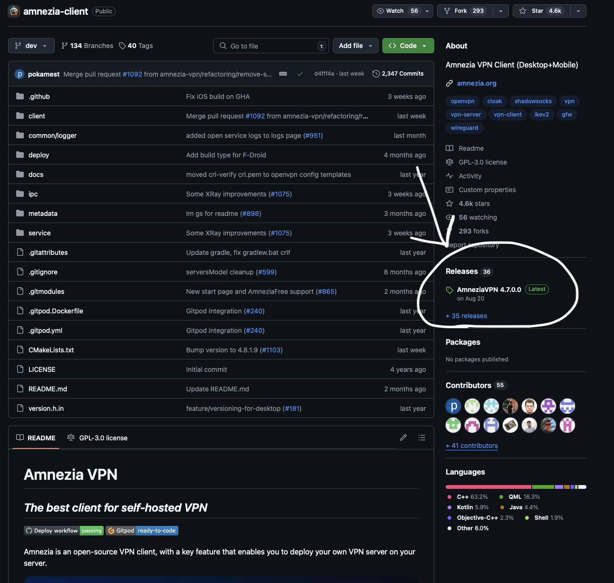
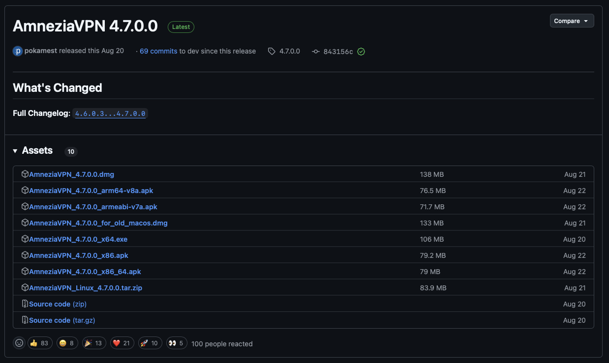

# Обход блокировки Дискорда и Ютуба

## Установка

- Скачайте файл WARP.conf на свое устройство (ПК, планшет, телефон)
- Скачайте приложение и установите AmneziaWG (https://github.com/amnezia-vpn/amnezia-client.git для ПК, или ищите в App Store или Google play, если нет, то заходите с зарубежных регионов)
	
## Установка на ПК

-Перейдите по ссылке и перейдите на кнопке на картинке:

-Нажмите на файл из перечисленных, для windows .exe, для MacOS .dmg, телефоны .apk, Linux .tar.zir

- Откройте приложение: Выберите пункт "Файл с настройками подключения" и выберите скачаный WARP.conf
- Пользуйтесь

# Данный способ доступен благодаря нашему СНГ коммьюнити и разработчикам AmneziaWG, я лишь распространяю способ
